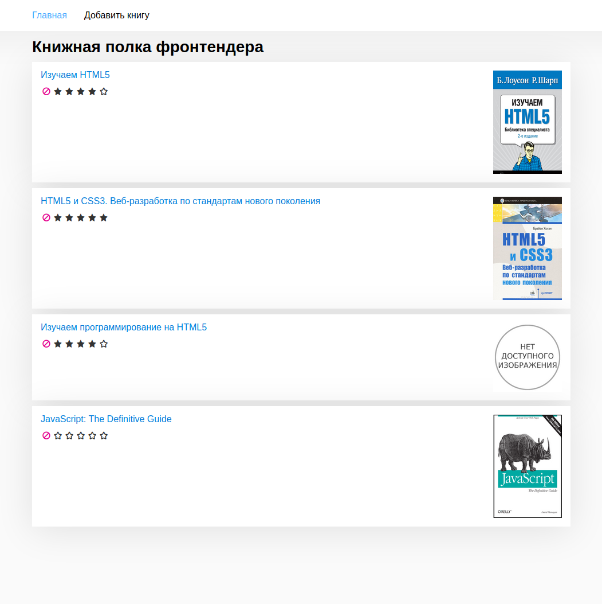

# AitargetBooks

This is test project for books CRUD.



## Stack:
- Angular
- SCSS
- [PrimeNG](https://www.primefaces.org/primeng/)

## Functional
- read books list from JSON
- add new books
- detail card for book
- update books
- used [PrimeNG](https://www.primefaces.org/primeng/) for rating and upload files

## Installation

Install with [npm](http://www.npmjs.com/):

```sh
$ npm install
```
or with [yarn](https://yarnpkg.com/)
```sh
$ yarn install
```

## Developing

Run develop with command

>`npm start`

Navigate to `http://localhost:4200/`.

Get prod builded files with command
>`npm run build:prod`